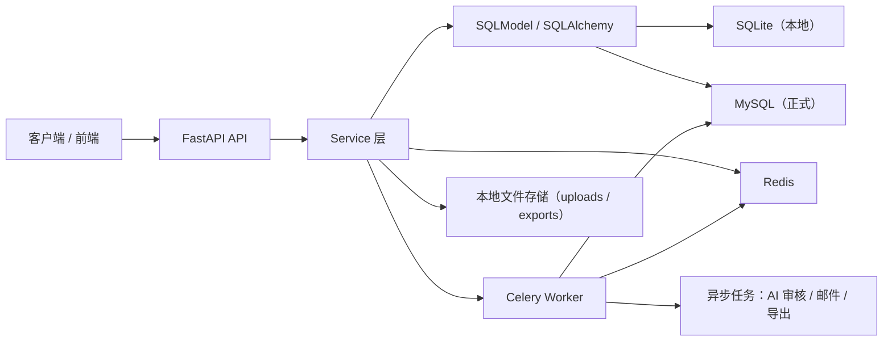

# 综测平台基本架构

## 1. 设计目标

本后端以“后端自包含、前端通过接口对接”为原则设计，重点解决以下问题：

- 学生申报、审核员审核、教师复核、归档、公示、申诉的全链路闭环
- 本地开发可使用 SQLite，正式部署可切换到 MySQL + Redis + Celery
- 邮件、AI 审核、导出等异步能力可独立扩展

## 2. 总体架构



## 3. 分层说明

### 3.1 API 层

路径位于 `app/api/v1/endpoints`。

职责：

- 接收 HTTP 请求
- 参数校验
- 调用业务服务
- 返回统一响应结构

### 3.2 Service 层

路径位于 `app/services`。

职责：

- 承载业务规则
- 维护状态流转
- 处理权限判断
- 触发异步任务

### 3.3 数据访问层

项目继续沿用 `SQLModel + SQLAlchemy`，避免因为切换 MySQL 而整体重写 ORM。

支持：

- SQLite：本地开发 / 自测
- MySQL：正式部署 / 联调环境

### 3.4 异步与缓存层

- Redis：黑名单、幂等键、导出状态、缓存
- Celery：AI 审核、邮件、导出任务

如果本地没有 Redis：

- 黑名单、幂等键、缓存会自动回退到进程内内存实现
- 方便 SQLite 单机调试
- 正式环境仍建议必须接入 Redis

### 3.5 文件存储

- 上传文件写入本地目录 `uploads`
- 导出文件写入本地目录 `exports`
- 数据库仅保存文件元数据与路径

## 4. 运行模式

### 4.1 本地模式

- `DATABASE_URL=sqlite:///./platform.db`
- `REDIS_ENABLED=false`
- `CELERY_TASK_ALWAYS_EAGER=true`

特点：

- 启动简单
- 便于本地自测
- 异步任务直接同步执行

### 4.2 正式模式

- `DATABASE_URL=mysql+pymysql://...`
- `REDIS_ENABLED=true`
- `CELERY_TASK_ALWAYS_EAGER=false`

特点：

- 使用 Alembic 迁移建库
- Celery Worker 独立运行
- Redis 提供真实幂等与黑名单能力

## 5. 核心业务模块

### 5.1 认证与用户

- 注册、登录、刷新、登出
- 修改密码
- 个人资料查询与更新
- access token 黑名单

### 5.2 学生申报

- 创建、修改、撤回、删除申报
- 上传附件
- 查询个人申报列表、分类汇总、详情

### 5.3 AI 审核

- 申报提交后写入 AI 审核任务
- 当前默认 `mock provider`
- 可输出报告与审核日志
- 失败时支持回退人工审核路径

### 5.4 审核员 / 教师审核

- 审核员处理 `pending_review / ai_abnormal`
- 教师处理 `pending_teacher`，也可复核已审核记录
- 驳回时触发异步邮件通知

### 5.5 导出 / 归档 / 公示 / 申诉

- 教师创建导出任务
- 导出完成后可选择生成归档记录
- 归档可发布为公告
- 学生可对公告发起申诉
- 教师处理申诉

### 5.6 系统管理

- 奖项字典
- 系统配置
- 系统日志

## 6. 状态流转

### 6.1 申报状态

```text
pending_ai
  -> pending_review
  -> ai_abnormal

pending_review
  -> pending_teacher
  -> rejected

pending_teacher
  -> approved
  -> rejected

approved / rejected
  -> archived
```

### 6.2 邮件状态

```text
queued -> mock_sent / failed
```

### 6.3 导出状态

```text
queued -> running -> completed / failed
```

## 7. 核心数据表

当前核心表包括：

- `user_info`
- `refresh_token_record`
- `comprehensive_apply`
- `reviewer_token_record`
- `review_record`
- `file_info`
- `application_attachment`
- `ai_audit_report`
- `export_task_record`
- `archive_record`
- `announcement_record`
- `appeal_record`
- `appeal_attachment`
- `email_record`
- `system_log`
- `system_config`
- `award_dict`

## 8. 安全与边界

- 所有业务接口统一使用 JWT 鉴权
- 审核权限在服务层再次校验，不依赖前端
- 文件下载支持权限判断
- 导出接口支持 `Idempotency-Key`
- 注册接口返回经过序列化的用户对象，不暴露密码哈希
